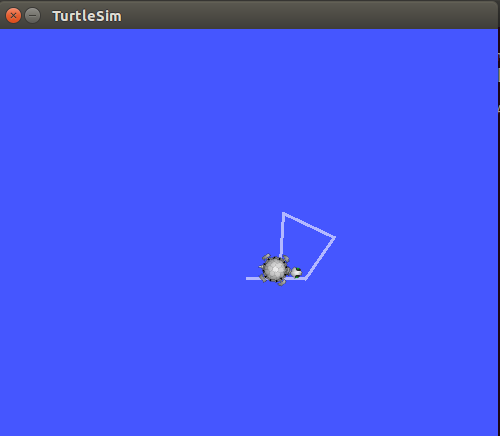

##Ubuntu14.04 ROS的安装##

###一、安装流程###
#####1、设置虚拟机，让其可以接受从ros.org上下的安装包，我是Ubuntu14.04，打开终端，输入如下命令,编辑源列表.#####

#####2、设置key#####

#####3、开始安装#####

3.1、更新包

3.2、Desktop-Full Install,这条指令的执行时间会很长，因为这是安装ROS的过程，请不要心急，耐心等待。在安装过程中，会出现选择yes和no的对话框，一定要选yes，其他数据默认就可以了，不用修改。

3.3、Desktop Install：

3.4、ROS-Base: (Bare Bones)

#####4、安装完成后查看#####
4.1、待安装完成以后，可以使用以下命令来查看已安装的可以使用的包：

4.2、然后需要对新安装的ROS进行初始化：

4.3、待上面的这条命令执行完成以后，可以看到有提示需要执行rosdep update命令，那么继续输入：

4.4、然后需要进行环境变量的设置,这个设置是永久性的，不需要每次打开一个终端都需要进行一次设置：

4.5接下来需要安装一个非常重要的工具rosinstall，这个工具在以后会非常有用的，安装命令如下：

至此Ros安装完成。

###二、测试###
安装ROS成功后,在Beginner Tutorials中有一个简单的示例程序，这里我利用了这个测试程序来进行测试：

1、在终端中输入下述命令，该命令是初始化ROS环境,全局参数,以及每个节点注册等工作.

2、 再打开一个Terminal,输入下诉命令.开启一个小乌龟界面：

3、 再打开一个Terminal,输入下诉命令.接受键盘输入,控制小乌龟移动.

5、再打开一个Terminal,输入下诉命令,可以看到当前ROS nodes以及Topic等图形展示.

由上图可见,左右两边矩形为ROS node,中间连线上是Topic名称.

###END###

