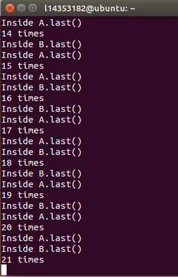

## DeadLock实验报告 ##

####1、产生死锁的四个必要条件：####
1、互斥使用（资源独占）：一个资源每次只能给一个进程使用 

2、不剥夺条件：资源申请者不能强行的从资源占有者手中夺取资源，资源只能由占有者自愿释放 

3、请求和保持（部分分配，占有申请）：一个进程在申请新的资源的同时保持对原有资源的占有（只有这样才是动态申请，动态分配） 

4、循环等待：存在一个进程等待队列{P1 , P2 , … , Pn},其中P1等待P2占有的资源，P2等待P3占有的资源，…，Pn等待P1占有的资源，形成一个进程等待环路。

####2、实验结果截图：####

####3、死锁产生原因分析：####
这段代码主要通过调试count--方法，来实现主线程持有a的对象锁并请求b的对象锁、子线程持有b的对象锁并请求a的对象锁的场景，即发生死锁，也即是说，线程t.start()后，count--，如果恰好发生了这一种情况：coun--循环条件结束了，主线程执行A类的methodA方法，占有了a的对象锁，然后再请求B的对象锁b.last()，而此时恰好算法调度到子线程t，也就是排到子线程来执行，子线程t调用了run方法，执行methodB方法，在这里中，子线程t占有了b的对象锁methodB()方法，然后请求a的对象锁a.last()，但是a的对象锁此时已被主线程占有，即a此时已在执行methodA()方法，不能执行a.last()方法，因此子线程t被阻塞，而当算法调度回到主线程时，主线程需请求b的对象锁，b的对象锁为子线程t占有，即b此时在执行methodB方法，因此不可能来执行b.last()方法，主线程被阻塞，这时就会发生死锁。

