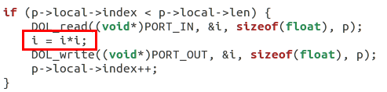

## 14353182 林庆军 DOL.MD ##

**Lab3Dol实例分析与编程任务：**修改Example1和2，使之符合要求 .

### 1、修改example1 ###

实验要求：
    使其输出3次方数.

example1之前的相关部分square.c：

它输出的结果是2次方数，由图可知，显然这是输入的数为i，输出的结果是经过计算后的i，而之前的计算为i=i*i，所以输出结果i为原来的平方。那么如果我们想要输出输入数的三次方结果，就只需修改这部分的i=i*i为i=i*i*i；其他不用修改，这样输出结果就为输入的3次方。修改后的函数如下：

编译修改后的example1,得到结果如下：

从图中结果可知，每一个输出均为输入的3三次方数 

我们得到的dot图如下：

### 2、修改example2 ###

实验要求：
    让三个square模块变为2个

模块的生成在example2.xml文件里，我们看一下没修改前的定义声明：

这一部分描述的就是生成square模块的部分，它使用了迭代器来迭代生成N个进程，一个进程代表一个模块，而第一句话声明了N的值为3，那么也就是说，这段代码生成了3个名为square的进程（模块）。

接下来看一下connection部分：

这一部分描述的就是生成connection连线的部分，它使用了迭代器来迭代生成N+1个链接，用于连接各个模块，数量是square模块数加generator和consumer模块数的总和减一，刚好比square模块数多一。
而我们需要将square模块的数量从3个变为2个，由于square模块的生成和链接的生成均是使用了iterator生成的，变量均为N，因此我们只需改变N的值即可改变生成的square模块数且不会出错（链接数匹配模块），因此我们将N的值改为2即可，如下图：

编译修改后的example2,得到结果如下：

我们得到的dot图如下：

### 实验感想 ###
通过这次实验，我大概了解了DOL的example的架构，一般而言，example里将各个进程的的功能定义放在了src里，里面目前example1、2里分别有4种类型的文件，一个是generator，生产者进程，用于生产数据，还有square进程，这是一个处理模块，在这里，它的处理结果是将生产者传送的数据平方后传送给consumer，consumer，消费者用于输出结果。而每一个example均有一个.xml文件，这个文件是系统架构即模块连接方式定义所在的文件，它将各个独立的模块连接起来从而成为一个整体的系统。

